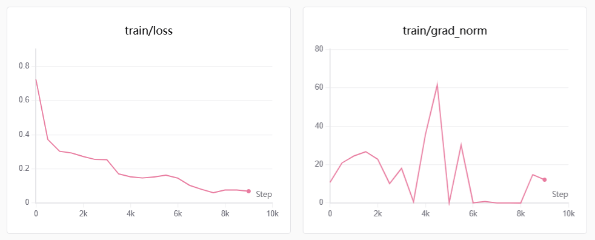
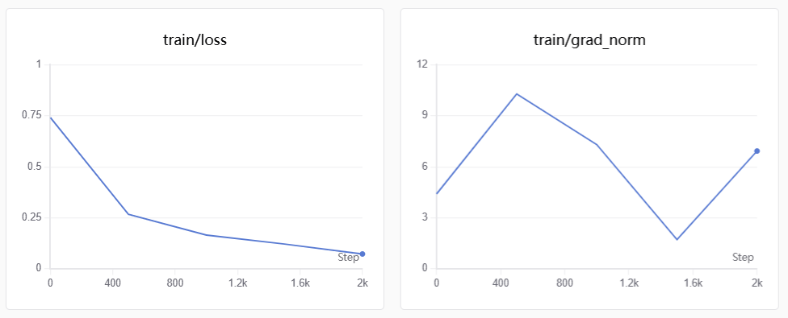
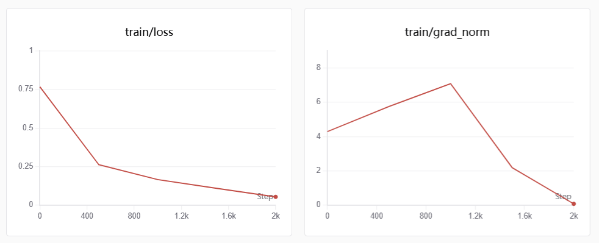
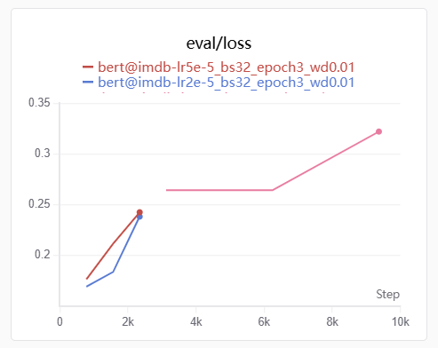

## Chapter 1: 微调BERT实现情感分类

> 本节参考教程: [BERT文本分类](https://docs.swanlab.cn/course/llm_train_course/01-traditionmodel/1.bert/README.html)

### Base、Instruct、Chat模型的区别

Base模型是预训练的产物，在大量Token上进行训练，使得模型拥有一定的世界知识，能够进行next token的预测。

Instruct模型在Base模型的基础上进行指令微调(SFT)，让模型能够理解和遵循指令以完成特定任务。不过此时局限于单轮对话，模型在多轮对话上的能力较差。

Chat模型在Instruct模型的的基础上使用多轮对话数据进行post training，并对齐人类偏好，进一步增强对话体验。

### BERT微调实现情感分类

BERT是一种encoder-only的模型，比较擅长分类任务。在我们的情感分析任务中，模型负责针对输入的文本输出其对应的情感标签，实现情感分类。


**模型微调的逻辑**

选择合适的模型和数据集，科学的划分数据集（训练集和测试集，测试集不能暴露在训练集中）。

```python
from datasets import load_dataset

data = load_dataset("imdb", cache_dir="./data") # cache_dir 指定数据集下载路径
```

imdb中划分了训练集和测试集，因此不必手动进行这部分内容。常规操作加载一个数据集后，使用`sklearn.model_selection`中的`train_test_split`函数。

假设本地有一个数据集`data.jsonl`，划分训练集和测试集的流程为：

```python
from sklearn.model_selection import train_test_split
import json

with open("data.jsonl", 'r', encoding='utf-8') as f:
    data = [json.loads(line) for line in f]

text = [item['text'] for item in data]
labels = [item['label'] for item in data]

train_text, test_text, train_labels, test_labels = train_test_split(text, labels, test_size=0.2, random_state=42) # 测试集占全部数据的20%

# 得到对应的训练集和测试集的样本数
print(len(train_text))
print(len(test_text))
```

由于模型本身无法直接处理文本数据，需要使用模型的tokenizer将文本切片形成token并根据词表将token映射为对应的token_id。

执行训练前需要定义好训练的超参数，`transformers`中封装了`TrainingArguments`类便于快速定义好配置。参数设定完成后能够利用封装好的`Trainer`类实现训练，传递模型，数据集和参数配置。

```python
from transformers import TrainingArguments, Trainer

training_args = TrainingArguments(
    output_dir='./results',          # 输出目录
    eval_strategy='epoch',           # 每个epoch评估一次
    save_strategy='epoch',           # 每个epoch保存一次
    learning_rate=2e-5,              # 学习率
    per_device_train_batch_size=8,  # 训练批次大小
    per_device_eval_batch_size=8,   # 评估批次大小
    num_train_epochs=3,              # 训练轮数
    weight_decay=0.01,               # 权重衰减
)
```

为了能够记录下训练过程中模型的各项指标变化，并对训练参数进行记录和管理，便于复盘总结，我们使用SwanLab监督训练过程。

首先需要在SwanLab上创建自己的账号，然后记录下自己的API_Key，在终端中执行命令`swanlab login`后输入自己的API_Key就绑定好自己的帐号了。

代码中具体使用时，需要定义好swanlab的回调函数，以便持续监控。

```python
import swanlab
from swanlab.integration.transformers import SwanLabCallback

# 设置swanlab回调函数
swanlab_callback = SwanLabCallback(project='BERT_fine_tuning',
    experiment_name='bert_bs8_lr2e-5',  # 实验关键参数直接写在实验名中 消融实验结果分析便于在swanlab上直观找到最佳参数组合
    config={'dataset': 'IMDB', "CLASS_NAME": CLASS_NAME})
```

然后在实例化`Trainer`中调用

```python
# 定义Trainer
trainer = Trainer(
    model=model,
    args=training_args,
    train_dataset=tokenized_datasets['train'],
    eval_dataset=tokenized_datasets['test'],
    callbacks=[swanlab_callback] ######### 回调
)
```

训练时执行`trainer.train()`即可，训练结束手动调用`swanlab.finish()`停止监控。

### 实验总结

本次实验进行了三组，第一组为baseline：`bert@imdb-lr2e-5_bs8_epoch3_wd0.01`，第二组为对照组1：`bert@imdb-lr2e-5_bs32_epoch3_wd0.01`，第三组为对照组2：`bert@imdb-lr5e-5_bs32_epoch3_wd0.01`

**baseline分析**

脚本中给定的默认参数为
```
lr: 2e-5
batch_size: 8
epoch: 3
weight_decay: 0.01
```
训练结束后在SwanLab上得到了下面的结果：



左图的loss曲线整体上还算平滑，但在4k~6k上出现了轻微的波动。右图的梯度范数出现了极大的震荡，且最终梯度范数为12，这表示模型此时尚未收敛。

可能的原因有以下几种：
- lr太大，导致参数更新幅度过大，对应的梯度范数震荡
- batch_size太小，算出来的方差大，更新误差大

因此在baseline的基础上，进一步调大batch_size，由8调到32.

**对照组1分析**

参数：
```
lr: 2e-5
batch_size: 32
epoch: 3
weight_decay: 0.01
```

得到下面的结果：



左图loss曲线下降比较平稳，右图中梯度范数波动较小。

为了进一步提高训练稳定性并提升模型性能，保持更新总量不变的情况下尝试增大lr看看效果如何。

**对照组2**

参数：
```
lr: 5e-5
batch_size: 32
epoch: 3
weight_decay: 0.01
```

效果如下：



相比对照组1，增大lr后明显可以看到训练梯度范数收敛了，说明对照组2训练过程更加稳定。

总体而言，对照组1和2最终表现上强于baseline，这说明baseline确实batch_size太小；从训练稳定性（经验）上来说，如果增大bs会带来训练上的增益，如加快训练速度，提升模型性能，在增大bs的同时增大lr也会带来不错的效果，能让训练更加稳定。

|train|eval|
|:--:|:--:|
|||

最终指标和eval_loss曲线上来看，各个模型存在严重的过拟合。

|metric(last)|baseline|对照1|对照2|
|:--:|:--:|:--|:--:|
|train_loss|0.0692|0.073|0.0543|
|eval_loss|0.322|0.2425|0.2383|

下一步环节过拟合的方法：早停、减少epoch

[完整图表:  https://swanlab.cn/@reed/BERT_fine_tuning/overview](https://swanlab.cn/@reed/BERT_fine_tuning/runs)

**小结**

进一步熟悉了swanlab的使用，规范实验命名。本次实验的命名有点冗余，应该首先记录好baseline的参数，后续修改时在baseline上加后缀，如baseline_bs32, baseline_lr5e-5，更加清晰规范。

实验分析，对训练接触较少，用于支撑判断的经验还不足够，更多的依靠AI分析，应该多做多沉淀经验。